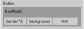
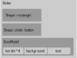

## Infrastructure

There are four levels of rendering layers from top to base:

* Layer 1: __control__
* Layer 2: __render tree__
    Each control corresponds with a sub-tree in the render tree. Each node on the render tree corresponds to a rectangle area. Styles are computed at this layer and applied to the primitive list.
* Layer 3: __primitive__
    The minimal abstract rendering unit: line-segments, rectangles, triangles, circles, polygon, ployline, arcs, bezier-curves, quadratic-curves and so on.  
	(Box-model borders are polygon primitives.)  
	A primitive is drawn inside the content-box of the node if the node uses box-model, or just inside the rectangle of the node.  
	For a node not using box-model:  
	  
	For a node using box-model:  
	
* Layer 4: __basic rendering API (interface)__
    Possible implementations:

    * [built-in] Path-based rendering API on top of OpenGL
    * cairo
    * other platform specific rendering API like Direct2D and Quartz

## Implementation Thoughts (General)

### concepts

* Brush: fill shapes with colors, images and patterns. It should be implemented in layer 2.
* Pen: draw outlines of a shape with colors, images and patterns. It should be implemented in layer 2.

__examples__

* Button  
  

* Slider  
  

### function of a render-tree node

1. a rectangular region: position and size
2. a rule set (style) container
3. a layout unit
4. a primitive container

### implementation changes

* Current implementation:

	1. modify the style on the fly
	2. create layout unit on the fly; reuse it when the layout is not changed; recreate all layout units when adding new layout unit or a layout unit changed.

* Future implementation based on render-tree:

	When calling control methods like `GUILayout.Button` and `GUILayout.BeginHorizontal`:

	1. modify the structure of the render-tree: add/remove a node, move a sub-tree around and so on
	2. modify the style of a sub-tree(a control)
	3. get the layout from layout engine based on the render-tree

	So, we need to refactor all control code and the layout engine, and finally the rendering pipeline.

__detail: re-layout trigger__

* What triggers a re-layout in the render tree?

	1. Add a new control.
	2. Remove an old control.
	3. Change the style of a control and it changes the position and/or size of the control.
    
	Causes: User action, animation and programmatic action.

* Important points

    - Setup a queue of the changes that are required.
	- Combine changes that can be combined.

reference: http://www.phpied.com/rendering-repaint-reflowrelayout-restyle/ (What triggers a reflow or a repaint)

Note ImGui will not repaint conditionally, it repaints every frame.

### detail: render what

* When implementing layer 4 - basic rendering API, what exactly should we *render*?*

For example, for builtin OpenGL-based rendering API implementation:

	[final output] front buffer => back buffer => mesh => primitives

So the main function of *Path-based rendering API on top of OpenGL* is to convert primitives to meshes.
 
### important: What is in a text primitive?

There could be two levels of data:

* Level 0: text(`System.String`)
* Level 1: Contours composed of line segments(`List<List<Point>>`) and quadratic curve segments(`List<(Point, Point, Point)>`)

_Contours_ can be generated by pango, DirectWrite and Typography(built-in) and rendered by built-in OpenGL-based text rendering solution.

- [ ] But there is a problem: what if someone want to switch to a different text rendering engine that use text as the input? Each text rendering engine uses a different abstraction and it's hard to integrate all of them into ImGui. This is to be considered in the future.

For now, we will just regard the contours as the content of a `TextPrimitive`.
